  

 

  &nbsp;&nbsp;
  

---

I am a founder and software engineer focused on high-performance infrastructure, intelligent data systems, and defensive security. I aim to solve complex problems and pioneer new intelligent systems of the highest caliber.

  
  
  
  

**B.S. Informatics** @ **University of Washington**

---

> **Koda** · Co-Founder &nbsp; 
>
> *Building an intelligent macOS personal agent translating natural language to system-level execution tailored for developer workflows.*
>
> - Built a macOS menu bar utility using on-device STT for real-time shell, git, and app management
> - Implemented hybrid AI orchestration using local pattern-matching for zero-latency and cloud-based LLM function calling for complex intent
> - Integrated pre-execution command guards and macOS Keychain for encrypted credential storage

> **Standard** · Lead Software Engineer &nbsp; 
>
> *Prototyping and scaling a real-time real estate data intelligence platform.*
>
> - Led full-stack development of a platform processing **40,000+ spatial data records**, featured at **NAR NXT 2025**
> - Built production ETL pipelines in Python (Scrapy) with schema versioning and incremental validation
> - Optimized query latency by **80%** (5s → 1s) via MongoDB aggregation and multi-tier Redis caching

---

> **Koda**
>
> *A voice-first AI pair programmer — talk to it; it does the engineering.*
>
> - Built a two-tier voice agent behind a LiveKit audio room, running 24/7 on a VPS with the phone as just a microphone and speaker
> - Autonomously navigates codebases, manages version control, and delegates to coding tools, reporting back in plain speech
> - Steerable by design: high-autonomy execution that stays conversational and under the user's direction

> **Grove**
>
> *Human-curated agentic memory — a locator, not an injector.*
>
> - Designed a memory model of plain-folder "context trees" curated entirely by the user, with nothing auto-remembered or injected behind their back
> - Built an engine that locates the right tree on return and reads it in full, resuming a session as if the abandoned one never ended
> - Inverts mainstream agentic memory: the machine never quietly remembers or forgets anything

> **Noesis**
>
> *Persistent intelligence layer for AI coding agents.*
>
> - Fused memory, workflow, and auto-integration into a single layer spanning 9 CLI coding tools
> - Engineered SQLite-backed memory with hybrid retrieval, a knowledge graph, and HMAC integrity
> - Shipped distribution adapters for Claude Code, Cursor, Copilot, Aider, Codex CLI, and more

> **[OpenVille](https://github.com/jeremykamber/openville)**
>
> *Autonomous Multi-Agent Tradespeople Marketplace & Negotiation Engine*
>
> - Built a semantic RAG engine using vector embeddings and cosine similarity for high-accuracy tradespeople discovery
> - Implemented weighted multi-factor ranking with real-time preference adjustments and cost/quality outlier detection
> - Designed a multi-stage pipeline handling reasoning, real-time agent negotiation, and transaction fulfillment

---

  

